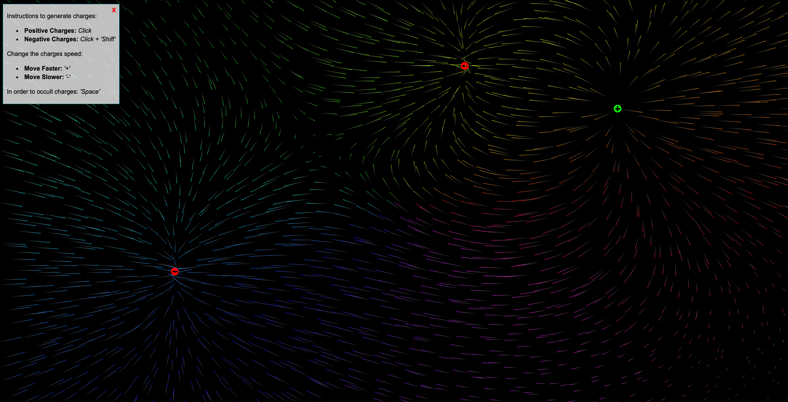

# Eletric Fields Simulation
This project aims to simulate electrical charges and their interaction in an environment, and was done in Javascript using WebGL.

## Play with it

[Click here](https://hugogspereira.github.io/eletric-fields/) in order to redirect to the website!

## Instructions
Instructions to generate charges:

- Positive Charges: `Click`
- Negative Charges: `Click + 'Shift'`

Change the charges speed:

- Move Faster: `+`
- Move Slower: `-`

In order to occult charges: `'Space'`